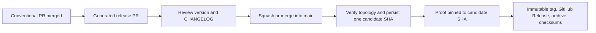

# Agent plugin repository template

Build one Git-distributed plugin for Claude Code and Codex.

- Share skills and portable runtime behavior.
- Keep native manifests and reload behavior separate.
- Author in Bun and TypeScript.
- Execute dependency-closed bundles through one verified, plugin-managed Bun runtime.
- Publish from GitHub Releases, not npm.
- Develop through each harness's native plugin workflow.

Consumers need Claude Code or Codex and Git access to the repository. They do not need a user-managed Bun, Node.js, Python, npm, or a setup command. The first use with a missing runtime requires one approved repair; warm use works offline.

The operator verification recipes also use a POSIX shell, `jq`, `awk`, and `diff`.

## Start a plugin repository

Create a repository from this GitHub template, clone it, and install [Bun](https://bun.sh/docs/installation) for development. Then initialize the plugin identity once:

```sh
bun run init -- \
  --name dojo-hello \
  --display-name "Dojo Hello" \
  --author "My Agent Dojo" \
  --repository https://github.com/myagentdojo/dojo-hello
```

`plugin.config.json` is the metadata owner. Generation derives both marketplace catalogs and both native manifests:

```sh
bun run generate:check
bun run prove:all
```

Commit generated files with their source. Never hand-edit a generated manifest or `plugin/runtime/hello-world.js`.

## Preflight a release tag

Inspect a release before changing either client. Set `FETCH_URL` to the same Git transport the marketplace will use. A public repository can use HTTPS. A private repository needs durable Git credentials because foreground installation and later background refreshes run Git independently.

```sh
set -eu
TAG=vX.Y.Z
FETCH_URL=https://github.com/OWNER/REPOSITORY.git
PREFLIGHT_ROOT=$(mktemp -d)
git clone --filter=blob:none --no-checkout "$FETCH_URL" "$PREFLIGHT_ROOT/repository"
git -C "$PREFLIGHT_ROOT/repository" fetch --no-tags origin "refs/tags/$TAG:refs/tags/$TAG"
REMOTE_SHA=$(git -C "$PREFLIGHT_ROOT/repository" rev-parse "refs/tags/$TAG^{commit}")
test -n "$REMOTE_SHA"
git -C "$PREFLIGHT_ROOT/repository" checkout --detach "$REMOTE_SHA"
test "$(git -C "$PREFLIGHT_ROOT/repository" rev-parse HEAD)" = "$REMOTE_SHA"
VERSION=${TAG#v}
test "$(jq -r .version "$PREFLIGHT_ROOT/repository/plugin/.claude-plugin/plugin.json")" = "$VERSION"
test "$(jq -r .version "$PREFLIGHT_ROOT/repository/plugin/.codex-plugin/plugin.json")" = "$VERSION"
jq -e '.plugins[0].defaultEnabled == false' "$PREFLIGHT_ROOT/repository/.claude-plugin/marketplace.json"
jq -e '.plugins[0].policy.installation == "AVAILABLE" and .plugins[0].policy.authentication == "ON_INSTALL"' "$PREFLIGHT_ROOT/repository/.agents/plugins/marketplace.json"
test -z "$(git -C "$PREFLIGHT_ROOT/repository" ls-tree -r "$REMOTE_SHA" plugin | awk '$1 == "120000"')"
git -C "$PREFLIGHT_ROOT/repository" ls-tree -r "$REMOTE_SHA" plugin > "$PREFLIGHT_ROOT/payload-inventory.txt"
```

For private SSH, verify GitHub's published host-key fingerprint, accept that key through an interactive SSH connection, and load the repository key before preflight:

```sh
set +e
SSH_GREETING=$(ssh -T git@github.com 2>&1)
SSH_STATUS=$?
set -e
printf '%s\n' "$SSH_GREETING"
if test "$SSH_STATUS" -ne 1; then
  echo "unexpected GitHub SSH greeting status: $SSH_STATUS" >&2
  exit 1
fi
ssh-keygen -F github.com
ssh-add -l
TAG=vX.Y.Z
FETCH_URL=git@github.com:OWNER/REPOSITORY.git
REMOTE_TAG=$(git ls-remote --refs "$FETCH_URL" "refs/tags/$TAG")
test -n "$REMOTE_TAG"
```

GitHub's successful SSH authentication greeting may exit with status 1 because it does not provide shell access. Verify the account named by the greeting before continuing.

For private HTTPS, configure a Git credential helper, then prove it can fetch the tag:

```sh
git config --get credential.helper
TAG=vX.Y.Z
FETCH_URL=https://github.com/OWNER/REPOSITORY.git
REMOTE_TAG=$(git ls-remote --refs "$FETCH_URL" "refs/tags/$TAG")
test -n "$REMOTE_TAG"
```

A token present only in an environment variable is insufficient. Do not continue until `git ls-remote` succeeds through the same SSH agent and known-hosts file, or the same HTTPS credential helper, that the client will inherit. Keep `$PREFLIGHT_ROOT`; it is the restoration and byte-comparison source if replacement fails.

## Install in Claude Code

These first-install examples use the default `user` scope. Run the preflight first.

For a public GitHub repository:

```sh
claude plugin marketplace add OWNER/REPOSITORY@vX.Y.Z
claude plugin marketplace list --json > "$PREFLIGHT_ROOT/claude-marketplaces-after-add.json"
claude plugin install PLUGIN_NAME@PLUGIN_NAME --scope user
claude plugin list --json > "$PREFLIGHT_ROOT/claude-plugins-disabled.json"
claude plugin enable PLUGIN_NAME@PLUGIN_NAME --scope user
claude plugin list --json > "$PREFLIGHT_ROOT/claude-plugins-active.json"
```

For a private repository over SSH:

```sh
claude plugin marketplace add git@github.com:OWNER/REPOSITORY.git#vX.Y.Z
claude plugin marketplace list --json > "$PREFLIGHT_ROOT/claude-marketplaces-after-add.json"
claude plugin install PLUGIN_NAME@PLUGIN_NAME --scope user
claude plugin list --json > "$PREFLIGHT_ROOT/claude-plugins-disabled.json"
claude plugin enable PLUGIN_NAME@PLUGIN_NAME --scope user
claude plugin list --json > "$PREFLIGHT_ROOT/claude-plugins-active.json"
```

An HTTPS private source uses `https://github.com/OWNER/REPOSITORY.git#vX.Y.Z` after the credential-helper preflight. For `project` or `local`, append the same `--scope project` or `--scope local` to marketplace add, install, enable, uninstall, and marketplace remove. Never cross scopes during replacement.

Inspect `claude-marketplaces-after-add.json` before installation. Confirm the marketplace name, pinned source, tag, scope, and host-selected snapshot match the preflight. Then verify the active install and its bytes:

```sh
jq -e '.[] | select(.id == "PLUGIN_NAME@PLUGIN_NAME" and .scope == "user" and .version == "X.Y.Z" and .enabled == true)' "$PREFLIGHT_ROOT/claude-plugins-active.json"
INSTALL_PATH=$(jq -r '.[] | select(.id == "PLUGIN_NAME@PLUGIN_NAME" and .scope == "user") | .installPath' "$PREFLIGHT_ROOT/claude-plugins-active.json")
diff -qr "$PREFLIGHT_ROOT/repository/plugin" "$INSTALL_PATH"
```

Generated Claude manifests install disabled by default. Claude Code clients older than `2.1.154` ignore `defaultEnabled: false`; use a supported client for this review-before-enable sequence. Start a new session or run `/reload-plugins` after verification. Claude automatic updates remain a user or team policy choice.

The replacement recipe below preserves the scope and persistent data. Remove the pinned marketplace entry only after both target and restoration preflights pass.

Official references: [plugin marketplaces](https://code.claude.com/docs/en/plugin-marketplaces), [plugins](https://code.claude.com/docs/en/plugins), and [plugin reference](https://code.claude.com/docs/en/plugins-reference).

## Install in Codex

Supported Codex surfaces: Codex CLI and Codex in the ChatGPT desktop app. This repository does not claim support for the IDE extension, Chat, mobile, or a universal Codex host.

Run the preflight first. For a public GitHub repository:

```sh
codex plugin marketplace add OWNER/REPOSITORY --ref vX.Y.Z
codex plugin marketplace list --json > "$PREFLIGHT_ROOT/codex-marketplaces-after-add.json"
codex plugin add PLUGIN_NAME@PLUGIN_NAME --json > "$PREFLIGHT_ROOT/codex-plugin-add.json"
codex plugin list --json > "$PREFLIGHT_ROOT/codex-plugins-after-add.json"
```

For a private repository over SSH:

```sh
codex plugin marketplace add git@github.com:OWNER/REPOSITORY.git --ref vX.Y.Z
codex plugin marketplace list --json > "$PREFLIGHT_ROOT/codex-marketplaces-after-add.json"
codex plugin add PLUGIN_NAME@PLUGIN_NAME --json > "$PREFLIGHT_ROOT/codex-plugin-add.json"
codex plugin list --json > "$PREFLIGHT_ROOT/codex-plugins-after-add.json"
```

An HTTPS private source uses `https://github.com/OWNER/REPOSITORY.git` with the same `--ref vX.Y.Z` after the credential-helper preflight. Codex has no Claude scope and does not use Claude's default-disabled installation behavior.

Inspect the marketplace snapshot and installed plugin before starting a task:

```sh
MARKETPLACE_ROOT=$(jq -r '.marketplaces[] | select(.name == "PLUGIN_NAME") | .root' "$PREFLIGHT_ROOT/codex-marketplaces-after-add.json")
INSTALLED_PATH=$(jq -r .installedPath "$PREFLIGHT_ROOT/codex-plugin-add.json")
test -d "$MARKETPLACE_ROOT"
test -d "$INSTALLED_PATH"
cmp "$PREFLIGHT_ROOT/repository/.agents/plugins/marketplace.json" "$MARKETPLACE_ROOT/.agents/plugins/marketplace.json"
diff -qr "$PREFLIGHT_ROOT/repository/plugin" "$INSTALLED_PATH"
jq -e '.installed[] | select(.pluginId == "PLUGIN_NAME@PLUGIN_NAME" and .version == "X.Y.Z")' "$PREFLIGHT_ROOT/codex-plugins-after-add.json"
```

Start an isolated task with `codex -C "$PREFLIGHT_ROOT"` and invoke one installed skill. A missing runtime returns `BUN_MISSING` without mutation. The agent previews the verified repair, asks for approval in plain language, runs `runtime/runtime-exec repair --apply` only after approval, and retries the skill. The lifecycle sidecar is a mechanics proof; it never installs, repairs, or configures the runtime.

### Fresh native capability qualification

All fresh-native cells remain **UNPROVED** until a person records receipts from fresh Claude and Codex profiles. `prove:harness-install` proves package bytes, declarations, installed bytes, and direct handler mechanics. It explicitly does not prove native activation, hook trust, UI presentation, or native delegation.

Keep raw receipts in the existing private qualification location under `$XDG_STATE_HOME/agent-plugin-template/runtime-custody/`, defaulting `XDG_STATE_HOME` to `~/.local/state`. Create every directory with mode `0700`, create every receipt with mode `0600`, and begin with `umask 077`. Extend the existing per-client receipt with a `nativeCapability` summary; do not create a second receipt framework. Use macOS and Linux POSIX hosts only; this lifecycle proof does not claim native Windows support.

For each client, bind the receipt to the exact source candidate SHA, archive SHA-256 from `*.checksums.json`, packaged payload hash, and independently measured installed payload hash. The packaged and installed hashes must match. A drift receipt also records the source candidate SHA and a distinct derived payload hash. `ship-canary` owns this candidate-lineage check.

Record these bounded cells per client:

- Fresh discovery and branded UI identity.
- Skill-seeded generic native delegation, a correlated handback, and host-owned subagent lifecycle evidence.
- One native `SessionStart` receipt for startup or resume.
- Host-observed zero-output clean `Stop` completion.
- One continuation from a disposable candidate-derived drift copy, with no other blocking Stop hook active.
- Silent `stop_hook_active: true` re-entry and unchanged fixture bytes.
- Capability-tour and existing-skill operation when hooks are disabled or untrusted, with `currentSessionHook: unknown` and no native-activation claim.

Claude qualification starts with the generated disabled plugin, verifies installed bytes, then enables it for a fresh session. Record the fallback in a separate fresh session with hooks disabled. Codex qualification first observes the untrusted fallback, reviews and trusts the exact hook definition through `/hooks`, then uses a second fresh task for activation receipts. A changed Codex definition requires fresh exact-definition review; a version-only release leaves the definition unchanged.

Promote only the receipt SHA-256 values, lineage hashes, platform/client labels, and bounded pass/fail conclusions. Never promote paths, prompts, transcript text, session data, environment dumps, or raw host receipts. The existing files remain `claude-cli-<candidate-sha>-<target>.json`, `codex-cli-<candidate-sha>-<target>.json`, and `codex-desktop-<candidate-sha>-<target>.json`. They also record the real `BUN_MISSING` → preview → approved repair → retry journey. Set `humanApprovalClaimed: true` only after actual human approval; automated platform and fixture receipts use `humanApprovalClaimed: false`.

The replacement recipe below preserves the marketplace source, ref, and prior `enabled` state. Remove the pinned marketplace entry only after target and restoration preflights pass.

Official references: [build Codex plugins](https://developers.openai.com/plugins/build/plugins), [Codex plugins](https://learn.chatgpt.com/docs/plugins), and [Codex developer commands](https://learn.chatgpt.com/docs/developer-commands?surface=cli).

## Upgrade and roll back

An upgrade and a rollback use the same replacement operation. Set the target to the newer tag for an upgrade or the older tag for a rollback. First capture current JSON state. Run the detached preflight above for both the target tag and the current restoration tag. Stop before uninstalling anything if either tag, commit, credential path, policy, payload, prior cache, or removal authority cannot be proved. Managed, workspace-installed, or non-removable plugins require an administrator.

### Claude Code replacement

Record `SCOPE`, `PRIOR_CLAUDE_SOURCE`, `PRIOR_ENABLED`, and the prior active cache from the JSON snapshots. Set `TARGET_CLAUDE_SOURCE` to the exact public, SSH, or HTTPS source with its tag. Preserve the same scope throughout:

```sh
claude plugin list --json > "$PREFLIGHT_ROOT/claude-plugins-before.json"
claude plugin marketplace list --json > "$PREFLIGHT_ROOT/claude-marketplaces-before.json"
claude plugin uninstall PLUGIN_NAME@PLUGIN_NAME --keep-data --scope "$SCOPE"
claude plugin marketplace remove PLUGIN_NAME --scope "$SCOPE"
claude plugin marketplace add "$TARGET_CLAUDE_SOURCE" --scope "$SCOPE"
claude plugin marketplace list --json > "$PREFLIGHT_ROOT/claude-marketplaces-target.json"
claude plugin install PLUGIN_NAME@PLUGIN_NAME --scope "$SCOPE"
claude plugin list --json > "$PREFLIGHT_ROOT/claude-plugins-target-disabled.json"
claude plugin enable PLUGIN_NAME@PLUGIN_NAME --scope "$SCOPE"
claude plugin list --json > "$PREFLIGHT_ROOT/claude-plugins-target-active.json"
```

Inspect the target marketplace JSON before install. After enablement, require the target version, the intended scope, the host-selected active cache path, and `diff -qr` equality with the target checkout. Ignore orphan cache directories that the host did not select.

If any step after uninstall fails, restore before doing other work:

```sh
claude plugin uninstall PLUGIN_NAME@PLUGIN_NAME --keep-data --scope "$SCOPE" || true
claude plugin marketplace remove PLUGIN_NAME --scope "$SCOPE" || true
claude plugin marketplace add "$PRIOR_CLAUDE_SOURCE" --scope "$SCOPE"
claude plugin install PLUGIN_NAME@PLUGIN_NAME --scope "$SCOPE"
if test "$PRIOR_ENABLED" = true; then
  claude plugin enable PLUGIN_NAME@PLUGIN_NAME --scope "$SCOPE"
else
  claude plugin disable PLUGIN_NAME@PLUGIN_NAME --scope "$SCOPE"
fi
claude plugin list --json > "$PREFLIGHT_ROOT/claude-plugins-restored.json"
```

Verify the restored version, scope, active cache bytes, enabled state, and persistent plugin data. Never delete the persistent plugin data directory. Private background refresh uses the configured Git credential path; a fetch failure keeps the prior installed cache. Run `claude plugin marketplace update PLUGIN_NAME` for a manual same-source refresh, then inspect before replacement.

### Codex replacement

Capture marketplace and plugin JSON first. Record `PRIOR_CODEX_SOURCE`, `PRIOR_CODEX_REF`, and `PRIOR_ENABLED`. Preflight both the target and restoration refs before removal:

```sh
codex plugin marketplace list --json > "$PREFLIGHT_ROOT/codex-marketplaces-before.json"
codex plugin list --json > "$PREFLIGHT_ROOT/codex-plugins-before.json"
codex plugin remove PLUGIN_NAME@PLUGIN_NAME --json
codex plugin marketplace remove PLUGIN_NAME --json
codex plugin marketplace add "$TARGET_CODEX_SOURCE" --ref "$TARGET_CODEX_REF" --json > "$PREFLIGHT_ROOT/codex-marketplace-target-add.json"
codex plugin marketplace list --json > "$PREFLIGHT_ROOT/codex-marketplaces-target.json"
codex plugin add PLUGIN_NAME@PLUGIN_NAME --json > "$PREFLIGHT_ROOT/codex-plugin-target-add.json"
codex plugin list --json > "$PREFLIGHT_ROOT/codex-plugins-target.json"
```

Inspect the marketplace JSON and installed root before plugin add. Then inspect the plugin JSON and installed path. Require the target source/ref, version, and byte equality with the detached target checkout.

If any step after removal fails, restore the exact prior source and ref immediately:

```sh
codex plugin remove PLUGIN_NAME@PLUGIN_NAME --json || true
codex plugin marketplace remove PLUGIN_NAME --json || true
codex plugin marketplace add "$PRIOR_CODEX_SOURCE" --ref "$PRIOR_CODEX_REF" --json > "$PREFLIGHT_ROOT/codex-marketplace-restored-add.json"
codex plugin add PLUGIN_NAME@PLUGIN_NAME --json > "$PREFLIGHT_ROOT/codex-plugin-restored-add.json"
codex plugin marketplace list --json > "$PREFLIGHT_ROOT/codex-marketplaces-restored.json"
codex plugin list --json > "$PREFLIGHT_ROOT/codex-plugins-restored.json"
```

Verify the restored source, ref, version, cache bytes, and enabled state. Codex CLI currently has no documented plugin enable/disable subcommand; restore a differing enabled state in the Codex plugin settings and confirm it with `codex plugin list --json` before continuing.

For the target install, start a fresh isolated task, confirm skill discovery, and exercise the missing-runtime repair/retry journey when the reviewed Bun identity changed. A new Bun version plus executable digest requires fresh approval; archive-only metadata changes do not change the approved runtime identity.

`codex plugin marketplace upgrade PLUGIN_NAME` is the documented explicit CLI operation for refreshing the configured Git snapshot. A pinned immutable tag should resolve to the same bytes. Automatic Codex marketplace refresh is unspecified; never rely on it to move or restore a release.

## Develop locally

Run a profile-safe preparation check first. These commands build local output and Codex staging, but do not change harness settings or installed plugins:

```sh
bun run dev -- claude --check
bun run dev -- codex --check
```

### Claude Code development

```sh
bun run dev:claude
```

This command:

1. Builds the portable JavaScript.
2. Watches runtime source, skills, hooks, and manifests.
3. Launches `claude --plugin-dir ./plugin`.
4. Disables the installed production plugin only inside that process, preventing duplicate stale skills or hooks.

Edit a file, wait for the successful rebuild, then run `/reload-plugins` in the same Claude session. Persistent Claude settings remain unchanged.

### Codex development

```sh
bun run dev:codex
```

Codex plugins are cached rather than loaded directly from the checkout. The command:

1. Builds the canonical `plugin/` payload.
2. Copies it into ignored `.dev` staging.
3. Adds build metadata only to the staged Codex version.
4. Creates or validates the local development marketplace.
5. Reinstalls the plugin and launches Codex.

After an edit, rerun the command and start a fresh task. This is reinstall-and-restart, not hot reload.

Do not symlink or sync only `skills/` into harness-global directories. That bypasses the manifests, launchers, runtime custody, cache identity, and installation boundary being tested.

## Add plugin behavior

Keep portable command logic under `runtime/src/`. Add dependency-bearing skills as isolated workspace members, then register them in the one logical skill catalog and regenerate the closed bundles and launchers.

```text
plugin/
├── .claude-plugin/plugin.json
├── .codex-plugin/plugin.json
├── skills/{hello-world,runtime-custody,skill-a,skill-b}/SKILL.md
├── bin/{hello-world,skill-a,skill-b}
├── THIRD-PARTY-NOTICES.md
└── runtime/
    ├── runtime-exec
    ├── runtime-lock.sh
    ├── skill-catalog.sh
    ├── bundle-inventory.{json,sh}
    ├── hello-world.js
    └── skill-{a,b}-<digest>.js
```

Both marketplace catalogs point at `./plugin`. Development staging, Git installation, packaging, and distribution proof all start from that subtree. Repository scripts, TypeScript source, Git metadata, and development state cannot enter the installed payload.

The portable process seam is:

```text
skill id + arguments + invocation identity
    -> stdout + stderr + exit code
```

| Area | Shared | Claude Code | Codex |
| --- | --- | --- | --- |
| Skills | Portable Agent Skills content | `/PLUGIN:SKILL` invocation and Claude extensions | `$SKILL` invocation and Codex extensions |
| Runtime | Closed bundles, generated launchers, and one Bun custody engine | Executes the shared launcher | Executes the shared launcher |
| Manifest | Plugin identity only | Claude-native manifest | Codex-native manifest |
| Lifecycle hooks | One shared fail-open mechanics handler | Native `SessionStart`/`Stop` declaration; plugin enablement controls activation | Native `SessionStart`/`Stop` declaration; exact hook definition requires user trust |
| Development refresh | Source and payload | Direct checkout plus `/reload-plugins` | Staged reinstall plus a fresh task |
| Harness-only features | Nothing by default | Keep Claude-only components native | Keep Codex-only components native |

Use [CONTEXT.md](CONTEXT.md) for canonical language. The architecture rationale lives in the ADRs for [one payload with native adapters](docs/adr/0001-one-payload-native-harness-adapters.md), [shared runtime custody](docs/adr/0005-shared-runtime-custody.md), [one Bun runtime](docs/adr/0006-single-bun-runtime-tier.md), and [closed workspace bundles](docs/adr/0007-workspace-authoring-bundled-distribution.md).

## Pull requests and CI

Use a Conventional Commit PR title. The title becomes the normal PR's squash commit and drives release notes:

```text
feat: add a portable command
fix(runtime): correct custody routing
docs: clarify private installation
```

Installable payload changes require a releasable title: `feat`, `fix`, `perf`, or any valid Conventional Commit type with `!` for a breaking release. A payload-changing `refactor`, `docs`, `test`, `ci`, `build`, or `chore` title fails the `Release impact` check unless it uses `!`. Documentation-, test-, and CI-only changes are exempt because they do not change the installed payload. The pure Release Please version projection is also exempt.

`feat` advances the minor version. `fix` and `perf` advance the patch version. `!` advances the major version. Documentation and maintenance changes appear only when configured as visible changelog sections.

Before opening a PR:

```sh
bun test
bun run generate:check
bun run release:validate
bun run prove:all
```

Hosted CI builds one candidate, then on Linux x64, Linux arm64, macOS arm64, and macOS x64 acquires the locked Bun asset through `repair --apply` into isolated state, runs a packaged skill, and proves warm reuse with custody network denied. It then creates the deterministic archive and `*.checksums.json`. The checksums bind the source commit, archive, runtime lock, bundle inventory, and payload inventory. They are integrity evidence for the named bytes, not independent publisher or builder authenticity. Public `main` artifacts receive GitHub artifact attestation. User-owned private repositories retain the checksums JSON and skip the unsupported attestation job.

### Optional Codex review gate

Require the `Codex review gate` status on `main` to make review opt-in without leaving every PR blocked. New PR commits start green. A maintainer with write access can comment `@codex review`; the status becomes pending. After the ChatGPT Codex Connector reports a clean review, inspect the conversation and comment `@codex-gate approve <reviewed-commit> <codex-comment-id>` using the 10- to 40-character reviewed SHA and the numeric ID from that exact Codex comment URL. When Codex reports findings, resolve them, push the fixes, and request another review of the new commit instead of approving the stale review.

Enable Codex code review for the repository before activating the required status. Approval requires write permission, the current commit, the exact bot-authored comment receipt bound to that commit, and no Codex review or inline-finding objects on it. The explicit attestation owns semantic judgment; the review conversation remains the source of finding details.

## Release

Normal PRs merge into `main` without publishing. Each push is classified as release-PR maintenance, publication, or incomplete-publication repair. Release Please only maintains one generated release PR that accumulates releasable commits. Its configuration sets `skip-github-release: true`; it never creates the version tag or GitHub Release.



### One-time GitHub setup

1. Open **Settings → Actions → General → Workflow permissions**. Keep the default workflow permission read-only and allow GitHub Actions to create and approve pull requests.
2. Enable squash merging for all PRs, including Release Please PRs. Merge commits may remain available as an optional release-PR path. Publication does not trust a merge-mode label: it verifies either a one-parent candidate or a two-parent merge candidate against the reviewed PR and its frozen base.
3. Protect `main` in two places. In **Settings → Branches → Branch protection rules**, require `Conventional Commit title`, `Release impact`, `Hosted public and private Git canaries`, all four `Compatibility` checks, and `Deterministic package`; readiness reads that classic branch-protection endpoint. In an active, no-bypass `main` ruleset, enable **Require a pull request before merging** and **Block force pushes**.
4. Open **Settings → Rules → Rulesets**. Create an active tag ruleset for `v*` that restricts tag deletion and updates with no bypass actors.
5. Open **Settings → Environments**. Create `release` and configure required reviewers for publication and same-tag asset replacement.
6. Create the public and private canary repositories named by `plugin.config.json`, then create the `hosted-canary-qualification` environment. Add `CANARY_GH_TOKEN`: a fine-grained token for the exact configured `canary.actor`, scoped only to both canary repositories, with Contents read/write, Actions read, and metadata read. Add `CANARY_SSH_PRIVATE_KEY` and `CANARY_SSH_KNOWN_HOSTS` for the same canary identity. Qualification uses the token-backed GitHub API identity and SSH Git identity, and limits writes to create-only immutable candidate refs. Keeping Git transport on SSH allows candidates containing workflow files without broadening the API token.

   Keep secret values out of repository files, logs, and readiness output. `bun run readiness` proves only that the environment and names exist; hosted qualification binds the token-backed GitHub API identity and SSH Git identity and proves their real access.
7. Create a fine-grained token or GitHub App token with only repository contents, pull requests, and issues write access. Store it as the GitHub Actions repository secret `RELEASE_PLEASE_TOKEN`.
8. Set the repository variable `RELEASE_PLEASE_AUTOMATION_LOGIN` to the exact login that token uses to author the release PR.
9. Authenticate `gh` with read access to repository settings, then run `bun run readiness -- --repo OWNER/REPOSITORY`.
10. Enable release automation only after readiness reports `READY`.

The immutable `v*` tag ruleset and the no-bypass `main` ruleset are human-owned safeguards outside the workflow. The `main` ruleset prevents a force push from steering the push event's trusted pre-merge base. Release automation never receives repository-administration authority; it cannot change either ruleset or its own release environment. `bun run readiness` is read-only and fails closed when the default branch, squash path, direct-push protection, effective merge-history policy, required checks, Actions permissions, tag ruleset, hosted-canary environment and secret names, or workflow authority cannot be proved. It reads secret metadata only, never secret values.

Release automation requires `RELEASE_PLEASE_TOKEN`; it does not fall back to `GITHUB_TOKEN`. GitHub suppresses workflow runs caused by `GITHUB_TOKEN`, which would leave the generated release PR without its required checks. The separate repository variable `RELEASE_PLEASE_AUTOMATION_LOGIN` records the exact login that owns the token; both the release-impact gate and publication admission bind that identity.

### Publish a release

1. Merge normal PRs with valid Conventional Commit titles.
2. Wait for the `Release` workflow's maintenance path to create or update the release PR. No tag or GitHub Release is created here.
3. Confirm the first release is `v0.1.0`; review the proposed semantic version, exact version projection, and generated `CHANGELOG.md`.
4. Squash-merge the release PR into `main`. A two-parent merge commit is also supported when merge commits are enabled and `main` does not require linear history.
5. Wait for the workflow to admit exactly one merged release PR bound to `github.sha`: base `main`, configured Release Please automation identity, only the allowed version projection, and a verified one-parent or two-parent topology. In both cases the first parent must equal both the trusted pre-merge base and the merged PR's frozen base, and every changed candidate blob must equal the corresponding blob from the reviewed PR head. A two-parent candidate must also bind its second parent to the reviewed PR head.
6. Confirm the workflow persisted `publication-candidate-<SHA>` before proof and checked out that candidate SHA. The persisted nine-field record is unchanged; parent topology is rederived from the immutable candidate commit instead of being trusted from the tag. Publication embeds the admission record in the annotated immutable release tag, so repair remains possible after the workflow artifact expires. Later movement of `main` does not change the candidate.
7. Wait for metadata validation, four-platform proof, deterministic packaging, and generated-drift rejection.
8. Approve the protected `release` environment. The workflow creates `vX.Y.Z` explicitly at the candidate SHA, verifies the remote tag target, then creates the GitHub Release with `--verify-tag --target <candidate-sha>`.
9. Confirm the Release contains the deterministic archive and `*.checksums.json`. For a public repository, confirm the archive attestation.

Do not hand-edit versions or `CHANGELOG.md`. Do not create the tag first. Do not publish to npm.

The one-parent path is intended for squash merges. GitHub does not expose a reliable field that proves which merge button produced a commit, so a lineage-equivalent single-commit rebase can satisfy the same checks. This is not a rebase-only support promise: readiness still requires squash merging because release PRs can contain multiple commits and ordinary PRs must remain squashable. Arbitrary or multi-commit rebases cannot pass admission because the candidate's first parent would not equal the trusted pre-merge and frozen PR base. Manual repair repeats these topology checks from GitHub and checks both the persisted identity and the fresh PR author against `RELEASE_PLEASE_AUTOMATION_LOGIN`; neither topology nor identity is self-authorized by the persisted record.

### Manually maintain or repair release state

Manual dispatch accepts two operation values. `maintenance` is the default; it only updates the standing release PR and never publishes. `repair` requires `release_tag` set to the exact existing `vX.Y.Z` tag. This repairs an incomplete publication; it does not create a new release.

Run release-PR maintenance explicitly with:

```sh
gh workflow run Release \
  --repo OWNER/REPOSITORY \
  --ref main \
  -f operation=maintenance
```

Start a compare-before-write repair with mismatched replacement disabled:

```sh
gh workflow run Release \
  --repo OWNER/REPOSITORY \
  --ref main \
  -f operation=repair \
  -f release_tag=vX.Y.Z \
  -f replace_mismatched_assets=false
```

The workflow resolves the existing immutable annotated tag, recovers and validates its embedded publication admission, checks out its commit, validates any existing GitHub Release target, and repeats the complete proof. The admission does not depend on the 90-day workflow-artifact retention window. It compares each archive and checksums asset before writing:

- Leave matching assets untouched.
- Add missing assets.
- Fail closed on a mismatched asset.
- Never move or recreate the tag at another commit.

If a mismatched asset is confirmed as the incomplete publication defect, rerun the same exact tag with replacement enabled:

```sh
gh workflow run Release \
  --repo OWNER/REPOSITORY \
  --ref main \
  -f operation=repair \
  -f release_tag=vX.Y.Z \
  -f replace_mismatched_assets=true
```

Required reviewers on the protected `release` environment authorize that same-tag replacement. The workflow uses `--clobber` only in this approved repair state. A missing public attestation is added after the archive matches.

Before the first release, `.github/.release-please-manifest.json` stays empty. The maintenance job detects that bootstrap state and passes `release-as: 0.1.0` for that run only. Once the first release PR records the root package version, later maintenance runs leave `release-as` empty and return to Conventional Commit versioning. After that release, the release configuration synchronizes:

- `package.json`
- `plugin.config.json`
- Claude marketplace metadata
- Claude native manifest
- Codex native manifest
- The version marker in generated portable JavaScript
- `.github/.release-please-manifest.json`

Validate the release contract locally:

```sh
bun run release:validate -- --json
```

For a public repository, verify the release archive attestation:

```sh
gh attestation verify dist/PLUGIN_NAME-X.Y.Z.tar.gz --repo OWNER/REPOSITORY
```

For a private user-owned repository, compare the downloaded archive with `archiveSha256` in the attached checksums JSON. This proves byte integrity against that file; it does not independently authenticate the publisher or builder.

Release machinery is based on [Release Please](https://github.com/googleapis/release-please), with a human-reviewed standing PR like Every's compound-engineering workflow. This single-plugin template additionally generates a committed changelog, validates every version surface, pins Actions to full commit SHAs, proves the payload before tagging, and attaches the deterministic package. See the [reviewed versioned release ADR](docs/adr/0003-reviewed-versioned-releases.md) for the publication boundary.

## Proof commands

- `bun test`: initializer, metadata, CLI, release, development, and canary contracts.
- `bun run generate:check`: generated manifests match `plugin.config.json`.
- `bun run build`: regenerate the Bun hello-world bundle, workspace bundles, notices, and inventory.
- `bun run prove:runtime-custody`: exercise missing, repair, corruption, concurrency, hostile-environment, and pass-through behavior.
- `bun run prove:runtime-platform -- --target <target>`: acquire the reviewed target asset, execute the packaged skill, and prove warm offline reuse.
- `bun run prove:distribution`: build twice, compare package bytes, extract the payload, prove Bun-only closure, and verify cold read-only guidance.
- `bun run prove:dx`: verify canonical marketplace paths and native development boundaries.
- `bun run prove:all`: complete local gate.

## Public and private canaries

Public and private Git-repository canaries qualify publishing-system changes only. They are not required for every recipient plugin release. CI classifies the owned release, package, install-proof, readiness, and canary paths. For a manual qualification after merge, run from a clean checkout of the exact `origin/main` commit:

```sh
bun run ship:canary -- --dry-run --ref origin/main
bun run ship:canary -- --execute --ref origin/main
```

Unprivileged PR CI checks generated manifests with the candidate's own generator. The privileged canary driver executes only trusted base code. It accepts the exact same-repository PR head, binds the active `gh` login and real SSH or HTTPS Git transport identity to trusted canary targets, verifies visibility and the exact source SHA, and never executes candidate code. The private canary receives that source commit. The public canary receives a deterministic root commit containing only `plugin/`, the Claude and Codex marketplace files, and a trusted minimal hosted-proof workflow, so private repository source and history cannot become public. Each target uses `refs/heads/candidate/<published-commit-sha>` and a create-only lease: the missing ref may be created or an identical concurrent winner accepted, but an existing ref cannot be replaced. Execute mode waits for hosted CI, then installs both native Claude and Codex clients through each proven Git remote and compares their caches with the exact published candidate. Candidate qualification lineage additionally binds the source commit, archive checksum, packaged payload hash, and installed payload hash before native claims can be promoted. It never deletes, replaces, or reuses candidate history.

These canaries prove this repository's Git publishing transport and native Git-marketplace installation path. They do not validate or claim OpenAI universal-directory ZIP acceptance, review, approval, or publication.

## Distribution boundaries

- **Implemented Git marketplace:** deterministic `tar.gz`, `*.checksums.json`, optional public GitHub attestation, pinned public/private Git sources, and public/private Git canaries.
- **Deferred OpenAI universal directory:** separate public ZIP, assets, publisher identity, portal submission, review, approval, and publication. Passing the generated directory-readiness text subset does not complete any of these steps.
- **Deferred Anthropic `claude-community`:** separate submission form, safety review, and catalog commit-SHA pinning. This repository does not submit or approve that catalog entry.

## Current boundaries

- macOS arm64/x64 and Linux arm64/x64 only.
- The locked x64 baseline assets support AVX-capable CPUs for this Bun 1.3.14
  candidate. Older no-AVX x64 hosts are outside the support boundary; custody
  executes `bun --version` before publication and refuses an unusable binary.
- Bun is pinned by version and per-target archive/executable digests; users do not install or pin it themselves.
- Publisher-reviewed bundles and dependencies execute with the user's normal Bun and OS capabilities. This is not a sandbox or an untrusted-plugin runtime.
- The build rejects native addons, statically visible computed loaders and direct `eval`/`Function` use, undeclared assets, and runtime package installation. These are deterministic bundle-hygiene checks, not adversarial capability confinement; publisher review owns indirect or obfuscated code, and architecture-layer isolation owns untrusted code (ADR 0006).
- Claude reloads a direct development plugin in the existing session. Codex needs a staged reinstall and fresh task.
- The capability-tour `SessionStart`/`Stop` sidecar is a fail-open lifecycle mechanics proof, not a production integrity or security guarantee. Runtime setup hooks, prewarm, doctor, inventory, and prune commands remain absent.
- Managed, workspace-installed, or non-removable plugins require administrator replacement or rollback.
- Vendor plugin specifications change. Recheck the linked official documentation when manifests, discovery, installation, or reload behavior changes.
