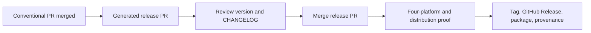

# Agent plugin repository template

Build one Git-distributed plugin for Claude Code and Codex.

- Share skills and portable runtime behavior.
- Keep native manifests, hooks, trust, and reload behavior separate.
- Author in Bun and TypeScript.
- Execute offline through bundled QuickJS runtimes.
- Publish from GitHub Releases, not npm.
- Develop through each harness's native plugin workflow.

Consumers need Claude Code or Codex and Git access to the repository. They do not need Bun, Node.js, Python, npm, or a post-install download.

## Start a plugin repository

Create a repository from this GitHub template, clone it, and install [Bun](https://bun.sh/docs/installation) for development. Then initialize the plugin identity once:

```sh
bun run init -- \
  --name dojo-hello \
  --display-name "Dojo Hello" \
  --author "My Agent Dojo" \
  --repository https://github.com/myagentdojo/dojo-hello
```

`plugin.config.json` is the metadata owner. Generation derives both marketplace catalogs and both native manifests:

```sh
bun run generate:check
bun run prove:all
```

Commit generated files with their source. Never hand-edit a generated manifest or `plugin/runtime/hello-world.js`.

## Install in Claude Code

For a public GitHub repository:

```sh
claude plugin marketplace add OWNER/REPOSITORY@vX.Y.Z
claude plugin install PLUGIN_NAME@PLUGIN_NAME
```

For a private repository, configure Git credentials first. Claude accepts a GitHub shorthand, HTTPS Git URL, or SSH Git URL:

```sh
claude plugin marketplace add git@github.com:OWNER/REPOSITORY.git#vX.Y.Z
claude plugin install PLUGIN_NAME@PLUGIN_NAME
```

Use the scope that matches the team:

```sh
claude plugin install PLUGIN_NAME@PLUGIN_NAME --scope user
claude plugin install PLUGIN_NAME@PLUGIN_NAME --scope project
claude plugin install PLUGIN_NAME@PLUGIN_NAME --scope local
```

To move to a later release, replace `vX.Y.Z` with the new release tag. Remove the pinned marketplace entry, repeat the matching `marketplace add` command above with that tag, then reinstall the plugin:

```sh
claude plugin marketplace remove PLUGIN_NAME
claude plugin install PLUGIN_NAME@PLUGIN_NAME
```

Start a new session or run `/reload-plugins`. Review installed hooks before trusting the plugin source.

Official references: [plugin marketplaces](https://code.claude.com/docs/en/plugin-marketplaces), [plugins](https://code.claude.com/docs/en/plugins), and [plugin reference](https://code.claude.com/docs/en/plugins-reference).

## Install in Codex

For a public GitHub repository:

```sh
codex plugin marketplace add OWNER/REPOSITORY --ref vX.Y.Z
codex plugin add PLUGIN_NAME@PLUGIN_NAME
```

For a private repository, configure Git credentials first and use an HTTPS or SSH Git URL:

```sh
codex plugin marketplace add git@github.com:OWNER/REPOSITORY.git --ref vX.Y.Z
codex plugin add PLUGIN_NAME@PLUGIN_NAME
```

To move to a later release, replace `vX.Y.Z` with the new release tag. Remove the pinned marketplace entry, repeat the matching `marketplace add ... --ref vX.Y.Z` command above with that tag, then reinstall the plugin:

```sh
codex plugin marketplace remove PLUGIN_NAME
codex plugin add PLUGIN_NAME@PLUGIN_NAME
```

Start a fresh Codex task after installation or update. Open `/hooks`, inspect the exact command definitions, and trust them only if they match the installed plugin. A changed definition crosses the trust boundary again.

Official references: [build Codex plugins](https://developers.openai.com/plugins/build/plugins), [Codex plugins](https://learn.chatgpt.com/docs/plugins), and [Codex developer commands](https://learn.chatgpt.com/docs/developer-commands?surface=cli).

## Develop locally

Run a profile-safe preparation check first. These commands build local output and Codex staging, but do not change harness settings or installed plugins:

```sh
bun run dev -- claude --check
bun run dev -- codex --check
```

### Claude Code development

```sh
bun run dev:claude
```

This command:

1. Builds the portable JavaScript.
2. Watches runtime source, skills, hooks, and manifests.
3. Launches `claude --plugin-dir ./plugin`.
4. Disables the installed production plugin only inside that process, preventing duplicate stale skills or hooks.

Edit a file, wait for the successful rebuild, then run `/reload-plugins` in the same Claude session. Persistent Claude settings remain unchanged.

### Codex development

```sh
bun run dev:codex
```

Codex plugins are cached rather than loaded directly from the checkout. The command:

1. Builds the canonical `plugin/` payload.
2. Copies it into ignored `.dev` staging.
3. Adds build metadata only to the staged Codex version.
4. Creates or validates the local development marketplace.
5. Reinstalls the plugin and launches Codex.

After an edit, rerun the command and start a fresh task. This is reinstall-and-restart, not hot reload.

Do not symlink or sync only `skills/` into harness-global directories. That bypasses the manifests, hooks, runtime assets, cache identity, and installation boundary being tested.

## Add plugin behavior

Keep portable command logic under `runtime/src/`. Keep the QuickJS I/O adapter small. Add harness behavior through the native manifest or hook file for that Harness.

```text
plugin/
├── .claude-plugin/plugin.json
├── .codex-plugin/plugin.json
├── skills/hello-world/SKILL.md
├── hooks/
│   ├── claude/hooks.json
│   └── codex/hooks.json
├── bin/hello-world
├── QUICKJS-LICENSE
└── runtime/
    ├── hello-world.js
    ├── quickjs-assets.json
    └── qjs-{darwin,linux}-{arm64,x86_64}
```

Both marketplace catalogs point at `./plugin`. Development staging, Git installation, packaging, and distribution proof all start from that subtree. Repository scripts, TypeScript source, Git metadata, and development state cannot enter the installed payload.

The portable process seam is:

```text
arguments + complete stdin + invocation identity
    -> stdout + stderr + exit code
```

| Area | Shared | Claude Code | Codex |
| --- | --- | --- | --- |
| Skills | Portable Agent Skills content | `/PLUGIN:SKILL` invocation and Claude extensions | `$SKILL` invocation and Codex extensions |
| Runtime | Generated JavaScript, launcher, and QuickJS assets | Executes the shared launcher | Executes the shared launcher |
| Manifest | Plugin identity only | Claude-native manifest | Codex-native manifest |
| Hooks | Command implementation only | Claude-native declarations, matching, and handlers | Codex-native declarations, matching, and trust |
| Development refresh | Source and payload | Direct checkout plus `/reload-plugins` | Staged reinstall plus a fresh task |
| Harness-only features | Nothing by default | Keep Claude-only components native | Keep Codex-only components native |

Use [CONTEXT.md](CONTEXT.md) for canonical language. The architecture rationale lives in the ADRs for [one payload with native adapters](docs/adr/0001-one-payload-native-harness-adapters.md) and [Bun-authored QuickJS execution](docs/adr/0002-bun-authoring-quickjs-runtime.md).

## Pull requests and CI

Use a Conventional Commit PR title. The title becomes the squash commit and drives release notes:

```text
feat: add a portable command
fix(claude): correct hook matching
docs: clarify private installation
```

`feat` advances the minor version. `fix` and `perf` advance the patch version. A `!` or `BREAKING CHANGE` advances the major version. Documentation and maintenance changes appear only when configured as visible changelog sections.

Before opening a PR:

```sh
bun test
bun run generate:check
bun run release:validate
bun run prove:all
```

Hosted CI runs QuickJS natively on Linux x64, Linux arm64, macOS arm64, and macOS x64. It then creates the deterministic archive and provenance JSON. Public `main` artifacts receive GitHub artifact attestation. User-owned private repositories retain provenance JSON and skip the unsupported attestation job.

### Optional Codex review gate

Require the `Codex review gate` status on `main` to make review opt-in without leaving every PR blocked. New PR commits start green. A maintainer with write access can comment `@codex review`; the status becomes pending until the ChatGPT Codex Connector submits a review for that exact commit. Push a new commit to reset the optional gate, then request another review when needed.

Enable Codex code review for the repository before activating the required status. The gate proves completion only. Resolve any Codex findings through the normal review conversation rules.

## Release

Normal PRs merge into `main` without publishing. Release Please keeps one generated release PR that accumulates releasable commits.



### One-time GitHub setup

1. Open **Settings → Actions → General → Workflow permissions**.
2. Keep the default workflow permission read-only; the release job requests narrowly scoped write permissions.
3. Allow GitHub Actions to create and approve pull requests.
4. Enable squash merging and keep the enforced Conventional Commit PR title.
5. Protect `main` and require the plugin CI and title checks for normal PRs.

The zero-secret configuration uses `GITHUB_TOKEN`. GitHub suppresses new workflow runs caused by that token, so the release workflow proves a merged release PR before it creates a tag. For strict pre-merge checks on the generated release PR, add a fine-grained token or GitHub App token as the `RELEASE_PLEASE_TOKEN` repository secret. Grant only repository contents, pull requests, and issues write access.

### Publish a release

1. Merge normal PRs with valid Conventional Commit titles.
2. Wait for the `Release` workflow to create or update the release PR.
3. Confirm the first release is `v0.1.0`; review its semantic version and generated `CHANGELOG.md`.
4. Merge the release PR when the batch is ready.
5. Wait for the `Release` workflow to validate metadata, prove the four-platform payload, reject generated drift, create `vX.Y.Z`, create the GitHub Release, and attach the deterministic archive plus provenance JSON.

Do not hand-edit versions or `CHANGELOG.md`. Do not create the tag first. Do not publish to npm.

If the tag and GitHub Release exist but asset upload or attestation failed, run the `Release` workflow manually with `release_tag` set to the exact existing `vX.Y.Z` tag. The workflow checks out that tag, repeats the full proof, uploads the archive and provenance with `--clobber`, and recreates the public attestation. Leave the input empty during normal operation.

Before the first release, `.github/.release-please-manifest.json` stays empty so Release Please bootstraps `v0.1.0`. After that release, the release configuration synchronizes:

- `package.json`
- `plugin.config.json`
- Claude marketplace metadata
- Claude native manifest
- Codex native manifest
- The version marker in generated portable JavaScript
- `.github/.release-please-manifest.json`

Validate the release contract locally:

```sh
bun run release:validate -- --json
```

For a public repository, verify the release archive attestation:

```sh
gh attestation verify dist/PLUGIN_NAME-X.Y.Z.tar.gz --repo OWNER/REPOSITORY
```

For a private user-owned repository, compare the SHA-256 value in the attached provenance JSON with the downloaded archive.

Release machinery is based on [Release Please](https://github.com/googleapis/release-please), with a human-reviewed standing PR like Every's compound-engineering workflow. This single-plugin template additionally generates a committed changelog, validates every version surface, pins Actions to full commit SHAs, proves the payload before tagging, and attaches the deterministic package. See the [reviewed versioned release ADR](docs/adr/0003-reviewed-versioned-releases.md) for the publication boundary.

## Proof commands

- `bun test`: initializer, metadata, CLI, release, development, and canary contracts.
- `bun run generate:check`: generated manifests match `plugin.config.json`.
- `bun run build`: regenerate portable JavaScript.
- `bun run spike:quickjs`: compare Bun and QuickJS behavior on the current platform.
- `bun run prove:distribution`: build twice, compare bytes, extract offline, verify interpreter digests, and run both harness command contracts.
- `bun run prove:dx`: verify canonical marketplace paths and native development boundaries.
- `bun run prove:quickjs-ci`: reproduce runtime, distribution, matrix, pinning, and attestation CI checks.
- `bun run prove:all`: complete local gate.

## Public and private canaries

After changes merge, run from a clean checkout of `origin/main`:

```sh
bun run ship:canary -- --dry-run
bun run ship:canary -- --execute
```

The command verifies GitHub identity, target visibility and lineage, no tracked changes, and generated manifests. Execute mode creates missing public and private recipients without starter commits, performs fast-forward-only pushes, and waits for both hosted workflows. It never force-pushes or rewrites recipient history.

## Current boundaries

- macOS arm64/x64 and Linux arm64/x64 only.
- QuickJS NG `0.16.1` is checksum-pinned in the payload.
- A future dependency on `Bun.*`, `node:*`, native addons, or unsupported Web APIs requires a fresh runtime decision and compatibility proof.
- Claude reloads a direct development plugin in the existing session. Codex needs a staged reinstall and fresh task.
- Hook declarations stay physically separate. A shared default `hooks/hooks.json` previously caused cross-harness auto-discovery.
- Vendor plugin specifications change. Recheck the linked official documentation when manifests, hooks, trust, or reload behavior changes.
