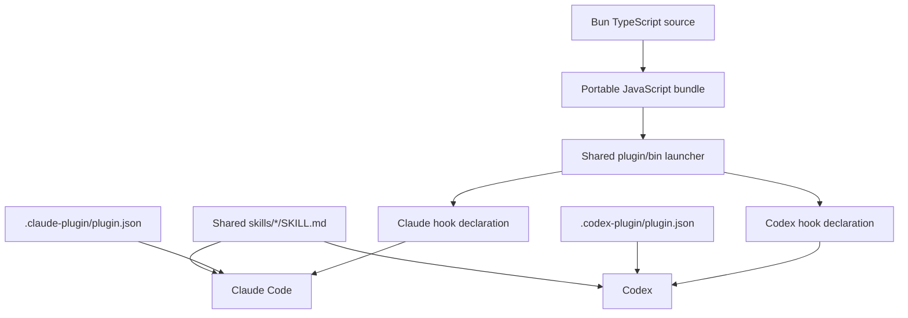

# Claude Code and Codex plugin compatibility

Snapshot: 2026-08-05. Local versions: Claude Code `2.1.222`; Codex CLI `0.146.0`.

## Answer

Share the skill files and runtime implementation. Keep manifests and hook declarations native to each harness.

The runtime seam is `args + stdin + invocation id -> stdout + stderr + exit code`. It contains no harness API. Each hook declaration translates its host into that process contract.

## Capability matrix

| Capability | Shared source? | Claude Code | Codex | Prototype rule |
| --- | --- | --- | --- | --- |
| Skills | Yes | `skills/<name>/SKILL.md`; invoked as `/plugin:skill`; Claude-specific frontmatter extensions | `skills/<name>/SKILL.md`; explicit `$skill` or implicit selection | Author the open Agent Skills subset once |
| Commands | No need | Legacy `commands/*.md` still works and behaves like skills | Not a plugin component | Use skills, not commands |
| Hooks | Runtime only | `hooks/hooks.json` or manifest path; five handler types | `hooks/hooks.json` by default or a manifest path; command handlers only today | Separate JSON declarations; call one launcher |
| Subagents | No | Plugin `agents/*.md` is supported | Codex has subagents, but the plugin manifest does not package an `agents` component | Add host-specific agents only when a workflow needs them |
| MCP servers | Server can be shared | `.mcp.json` or manifest `mcpServers`; starts when enabled | `.mcp.json` or `mcpServers`; per-plugin enablement and approval policy | Share the MCP protocol/server; validate each host config |
| LSP servers | No | `.lsp.json` or `lspServers` is a plugin component | Not listed in the Codex plugin manifest | Claude-only adapter |
| Apps and UI | MCP server can be shared | No ChatGPT plugin UI component; MCP tools remain usable | `.app.json`, MCP Apps, and optional ChatGPT UI are supported | Keep headless MCP tools useful; add UI as an OpenAI surface extension |
| Background monitors | No | Experimental `monitors/monitors.json` | Not listed as a plugin component | Claude-only |
| Themes and output styles | No | Plugin themes and output styles are supported | Not listed as plugin components | Claude-only |
| Default settings | No | Root `settings.json`; currently limited supported keys | Plugin-scoped policy lives in Codex config, not a bundled root settings component | Keep host policy outside shared runtime |
| Executables | Yes | Root `bin/` is added to Bash `PATH` while enabled | Package files are available through `PLUGIN_ROOT` | Ship a direct launcher and reference it explicitly from hooks |
| User options | No | Manifest `userConfig`, including sensitive keychain-backed values | No equivalent manifest field documented | Claude-only; prefer MCP auth for cross-host services |
| Install metadata | No | `.claude-plugin/plugin.json` and Claude marketplace metadata | `.codex-plugin/plugin.json` plus rich `interface` metadata | Two small manifests in one payload |

Sources: [OpenAI plugin packaging](https://developers.openai.com/plugins/build/plugins), [OpenAI hooks](https://learn.chatgpt.com/docs/hooks), [OpenAI skills](https://learn.chatgpt.com/docs/build-skills), [Claude Code plugin reference](https://code.claude.com/docs/en/plugins-reference), [Claude Code hooks](https://code.claude.com/docs/en/hooks), and [Claude Code skills](https://code.claude.com/docs/en/slash-commands).

## Hook differences

### Event surface

The useful common event set is:

- `SessionStart`
- `UserPromptSubmit`
- `PreToolUse`
- `PermissionRequest`
- `PostToolUse`
- `PreCompact`
- `PostCompact`
- `SubagentStart`
- `SubagentStop`
- `Stop`
- `SessionEnd`

Claude Code additionally documents events such as `Setup`, `UserPromptExpansion`, `PermissionDenied`, `PostToolUseFailure`, `PostToolBatch`, `Notification`, `MessageDisplay`, task events, worktree events, file/config/directory events, `InstructionsLoaded`, `Elicitation`, and `ElicitationResult`. Treat them as Claude-only until Codex documents an equivalent.

### Handler and execution contract

| Concern | Claude Code | Codex |
| --- | --- | --- |
| Handler types | `command`, `http`, `mcp_tool`, `prompt`, `agent` | `command` only; prompt and agent forms are parsed but skipped |
| Command form | Exec form with `command` plus `args`, or shell form | Shell command string; optional Windows override |
| Async | Supported for command hooks | Parsed but not supported |
| Trust | Plugin source and workspace trust boundaries; `/hooks` is read-only inspection | Exact non-managed hook definition must be reviewed and trusted; changed hash returns to review |
| Disable | Global `disableAllHooks`; no individual toggle | `/hooks` can trust or disable individual non-managed hooks; feature and managed-policy switches also exist |
| Matcher behavior | Event-specific strings and richer conditions | Regex; only documented events honor it; `Stop` and `UserPromptSubmit` ignore it |
| Plugin root | `${CLAUDE_PLUGIN_ROOT}` and `CLAUDE_PLUGIN_DATA` | `PLUGIN_ROOT` and `PLUGIN_DATA`; Claude variable aliases also set for compatibility |

Do not share hook JSON merely because many event names match. The matching, trust, handler, output, and reload semantics differ.

## Skill compatibility

The portable skill subset is small and useful:

- `name`
- `description`
- Markdown instructions
- relative references, scripts, templates, and assets inside the skill directory

Claude Code extends skills with fields and behavior such as `disable-model-invocation`, `allowed-tools`, named arguments, `context: fork`, dynamic command substitution, and component-scoped hooks. Codex has its own optional `agents/openai.yaml` interface, invocation policy, and tool dependency metadata.

Cross-host rule: keep the shared `SKILL.md` on the open subset. Put host-only behavior in a host adapter or a separately named host-specific skill when ignoring the extension would change safety or meaning.

## Development and reload

| Lane | Claude Code | Codex |
| --- | --- | --- |
| Direct development | `claude --plugin-dir ./plugin` | Install from a local marketplace cache |
| Refresh after edit | `bun run build`, then `/reload-plugins` | Rebuild, stage exact `plugin/`, add cachebuster to staged manifest, reinstall |
| Conversation boundary | Existing session can reload | Start a fresh task |
| Production | Marketplace update, then reload/start boundary | Marketplace refresh and a fresh task |

Claude Code explicitly reloads skills, agents, hooks, MCP servers, and LSP servers with `/reload-plugins`. Codex skills can be detected automatically in local authoring locations, but installed plugin bundles are cached; this prototype treats a fresh task after reinstall as the reliable boundary.

## Decision for this repo

- Make `plugin/` the only installable payload.
- Point both marketplace catalogs at `./plugin`.
- Compile Bun-authored TypeScript into `plugin/runtime/hello-world.js`.
- Vendor four checksum-pinned QuickJS executables under `plugin/runtime/`.
- Share `plugin/skills/`, `plugin/bin/`, and the generated runtime.
- Keep `plugin/hooks/codex/hooks.json` for Codex.
- Keep `plugin/hooks/claude/hooks.json` for Claude Code.
- Point each native manifest at its explicit hook path. Current Codex docs support manifest hook paths. The live dual-harness proof found that relying on the Codex default file caused Claude to load the wrong adapter, so this repo does not use `hooks/hooks.json`.
- Keep both native manifests.
- Package the exact `plugin/` contents. Exclude source, Git metadata, scripts, and development staging.

## Recheck triggers

Refresh this matrix when either host changes its plugin manifest, hook handler support, reload behavior, or bundled-agent support. Those areas are active and version-sensitive.
